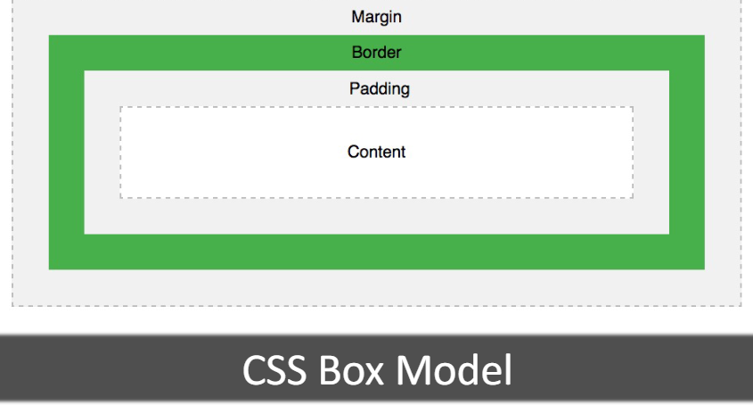

# HTML_CSS_JavaScript

* playground for lecture SQ

## HTML

* https://tableizer.journalistopia.com/
* HTML links are defined with the `<a>`tag
    - `<a href="http://www.uni-konstanz.de">This is a link</a>`
* HTML images are defined with the ``tag
    - The source file (src), alternative text (alt), and size (widthandheight) are provided asattributes
    - `<imgsrc=”uni.png"alt=”UniKonstanz"width="152"height="104">`
* HTML nur für die Struktur des Files
## CSS

* cascading style sheets
    - inline using a style attribute
    - internal using a `<style>` element in the `<head>` section
    - external using one or more external CSS files
* mit CSS festlegen, wie es ausschauen soll
* mit de Selektion nur Elemente formatieren die eine bestimmte ID haben
* div container
    - 

[//]: # (    - ![sus.png]&#40;..%2F..%2FOneDrive%2FBilder%2Fsus.png&#41;)

## JavaScript
* ``
* wie führt man das Script file aus?
    - man muss angeben wann etwas ausgeführt werden soll (e.g. on start, on click)